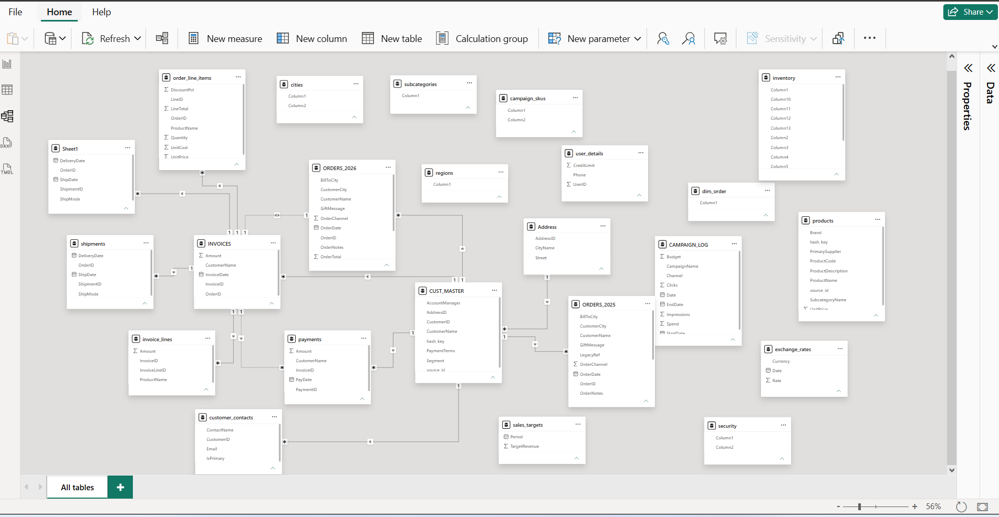
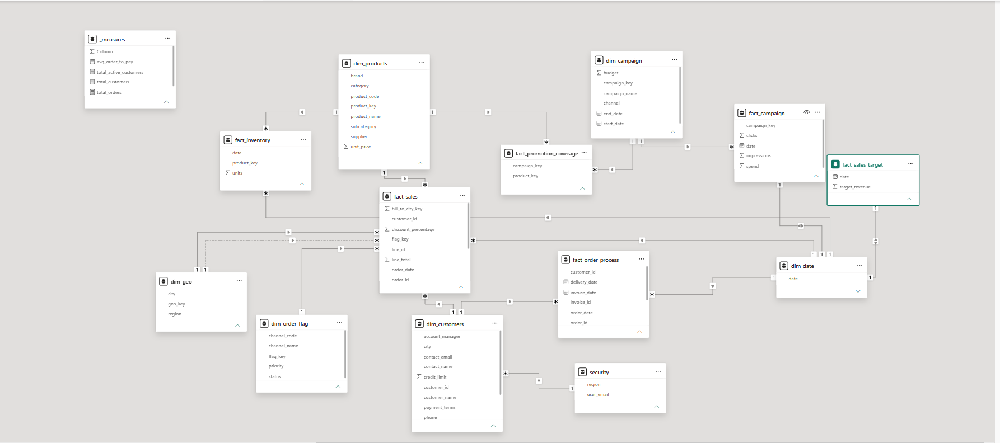

# Power BI Data Modelling Project

## Overview
Rebuilt a real-world nightmare Power BI data model into a 
clean, structured star/galaxy schema. The original dataset 
contained 23 messy tables with mixed fact and dimension data, 
missing keys, duplicate tables, no naming standards, and 
confusing relationships that made accurate reporting impossible.

## Before — The Nightmare Model

## What Was Fixed
- Separated mixed fact and dimension tables into proper structure
- Resolved missing keys and established correct relationships
- Removed duplicate and redundant tables
- Applied consistent naming conventions and standards
- Built a dedicated measures table for core calculations
- Implemented a security table for row level security

## After — The Clean Model

## Final Model Structure
| Table Type | Count |
|---|---|
| Fact Tables | 6 |
| Dimension Tables | 6 |
| Security Table | 1 |
| Measures Table | 1 |
| **Total** | **14** |

## Key Concepts Applied
Star schema, galaxy schema, Proper fact and dimension table design, 
relationship management, DAX measures, row level security, standards,
naming conventions

## Tools Used
Power BI Desktop
