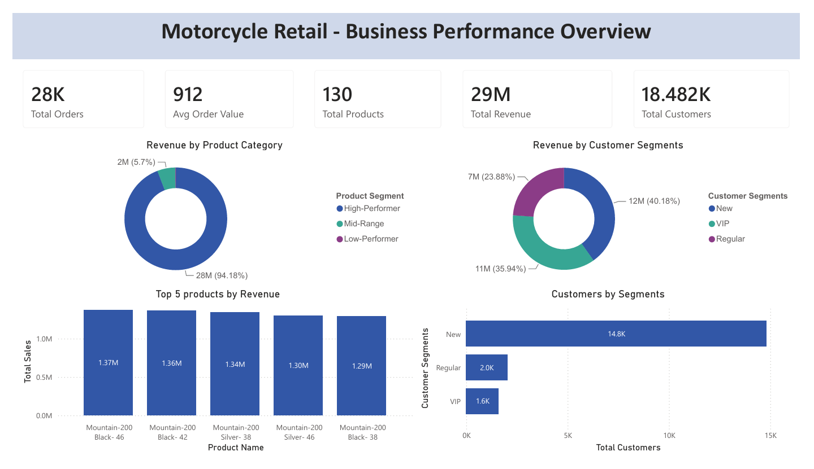
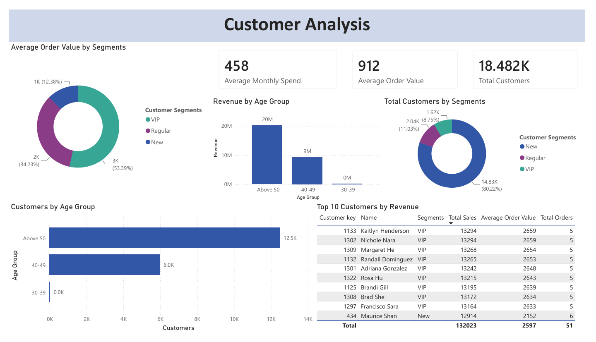
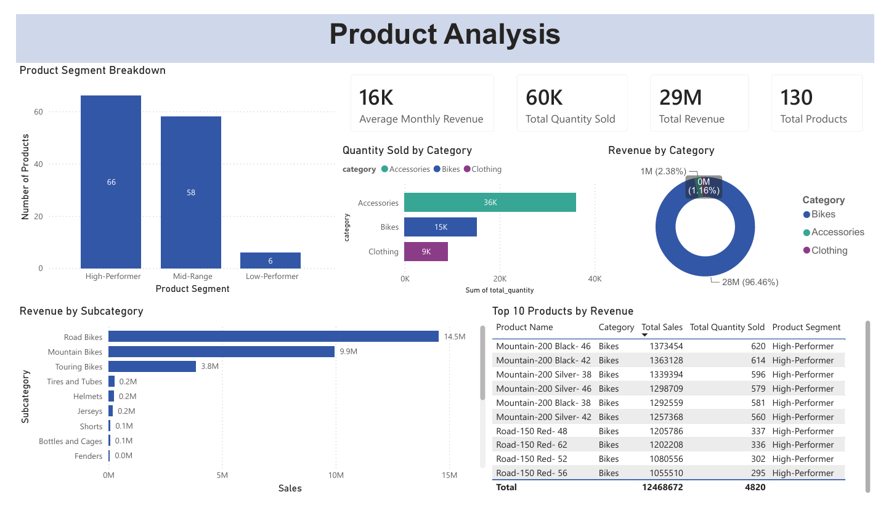

# Motorcycle Retail Dashboard

## Dashboard Report
[Download Full Report (PDF)](motorcycle_retail_powerbi_dashboard.pdf)

## Overview
A three-page Power BI dashboard analyzing customer and product 
performance for a motorcycle retail business, built using the 
customer and product report views created in SQL. The dashboard 
covers an executive summary, customer segmentation and behaviour, 
and product performance across categories translating raw SQL 
analysis into a visual, interactive format.

## Dashboard Preview

### Executive Summary
The business generated $29M in total revenue from 18,482 customers 
across 28K orders and has a total of 130 products.

### Customer Analysis
Customers aged Above 50 make up the largest age group at 12.5K 
customers and also generate the highest revenue among age groups 
at $20M. Average order value varies sharply by segment - VIP 
customers average $3K per order (53% of total), Regular customers 
average $2K (34%), and New customers average $1K (12.38%).

### Product Analysis
Accessories are the most frequently sold category at 36K units, 
followed by Bikes at 15K and Clothing at 9K. However, this 
contrasts sharply with revenue contribution, Bikes generate 96.5% 
of total revenue despite ranking second in units sold, since 
individual bikes carry a significantly higher price point than 
accessories or clothing.

---

## Data Source
This dashboard was built using customer and product report views 
created in SQL. View the full SQL analysis here: 

[Motorcycle Retail SQL Analysis](https://github.com/MishaalAbdussalam/sql-portfolio/tree/main/motorcycle_retail_project)
